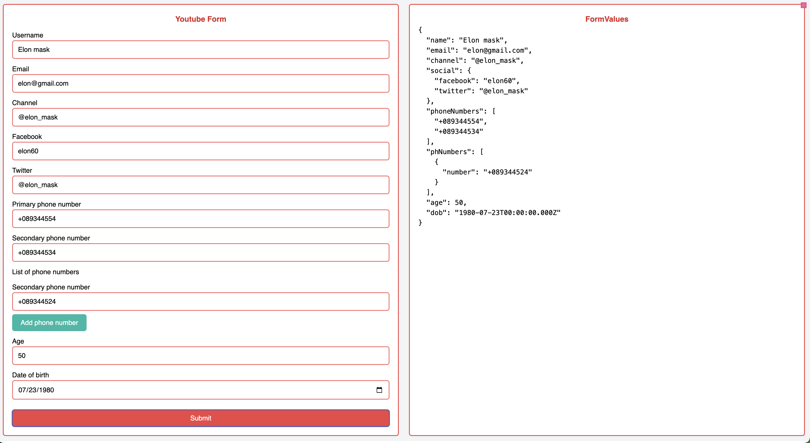

# React Hook Form Example

## Overview

This project is designed to practice using React Hook Form. The project is a simple form that allows users to input their name, email, and password. The form will validate the input and display an error message if the input is invalid.

## Getting Started

### Installation

1. Clone the repo:

   ```sh
   git clone https://github.com/mahmudulnayeem/react-hook-form-practice.git
   ```

2. Install NPM packages:

   ```sh
   yarn install
   ```

3. Start the development server:

   ```sh
   yarn dev
   ```

4. Open [http://localhost:5173/](http://localhost:5173/) in your browser.

   
